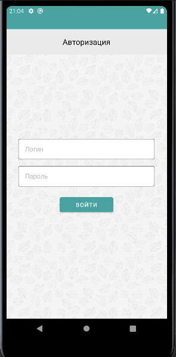
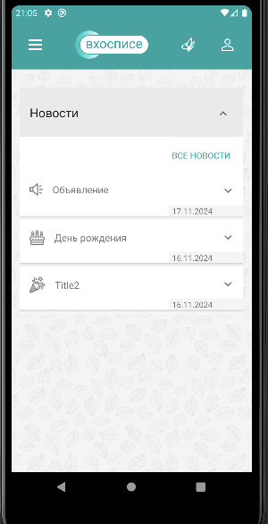
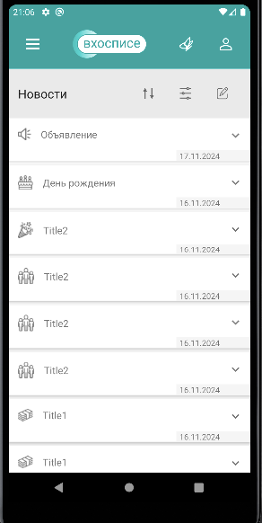
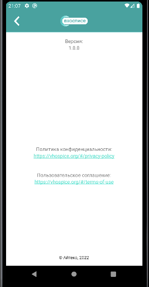
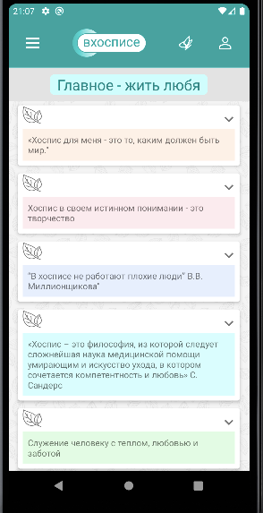
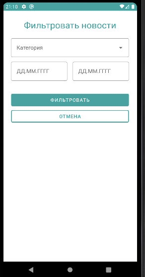
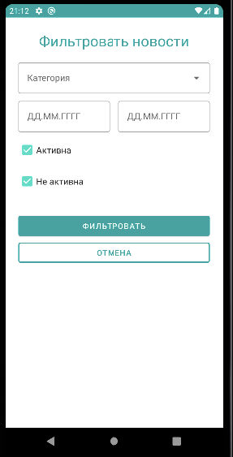
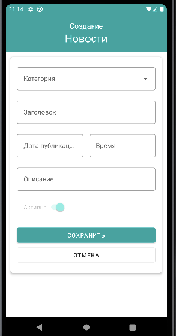

# План тестирования мобильного приложения "Вхосписе"

Содержание

1. [Описание приложения](#1-описание-приложения)
2. [Критерии начала и окончания тестирования](#2-критерии-начала-и-окончания-тестирования)
3. [Этапы выполнения](#3-этапы-выполнения)
4. [Перечень используемых инструментов/устройств](#4-перечень-используемых-инструментовустройств)
5. [Перечень необходимых специалистов для автоматизации](#5-перечень-необходимых-специалистов-для-автоматизации)
6. [Тестовая документация](#6-тестовая-документация)
7. [Перечень тест-кейсов для автоматизации](#7-перечень-тест-кейсов-для-автоматизации)
8. [Перечень возможных рисков при тестировании](#8-перечень-возможных-рисков-при-тестировании)
9. [Интервальная оценка с учётом рисков в часах](#9-интервальная-оценка-с-учётом-рисков-в-часах)

## 1. Описание приложения

Приложение даёт функционал по работе с новостями хосписа и включает в себя:
- информацию о новостях и функционал для работы с ними;
- тематические цитаты;
- информацию о приложении.

Состоит из следующих страниц:
- страница авторизации;
- главная страница;
- страница с цитатами;
- страница с новостями (с возможностью сортировки, установления фильтра, создание, редактирование и удаление новостей);
- страница о приложении
___
## 2. Критерии начала и окончания тестирования

Начало тестирования:
- анализ (оценка) требований, оценка возможности применения автоматизированного тестирования;
- подготовка плана тестирования, выбор инструментов тестирования, оценка трудозатрат;
- подготовка тестовых данных и создание тест-кейсов;
- настройка тестового окружения;
- выполнение тестирования в соответствии с планом, получение результата тестирования.

Окончание тестирования:
- анализ результатов тестирования;
- отчет о завершении тестирования.
___
## 3. Этапы выполнения

### **Проверка приложения.**

1. Скачать [архив с приложением](https://drive.google.com/drive/u/1/folders/14Sl8CAiIzFqtyXx6BAmWVlbu3_cXXzH1), открыть его в Android Studio и установить на устройство.   
   Данные для авторизации:

- login2;
- password2.

2. Выполнить проверку приложения по этапам:

  2.1 Планирование: определить «границы» приложения, реализованный функционал и заложить основу для тестов

При запуске приложения изначально открывается Splash Screen с тематической фотографией и цитатой.

Далее открывается страница "Авторизация", которая включает в себя следующие поля для заполнения:
- логин;
- пароль;
- кнопку "Войти".

При вводе данных зарегистрированного пользователя происходит переход на главную страницу
приложения.

Страница "Главная" содержит:
- гамбургер-меню (с выпадающим списком страниц приложения: "Главная", "Новости", "О приложении");
- элемент в виде бабочки (переход на страницу с тематическими цитатами);
- элемент в виде "силуэта человека" (выход из профиля);
- раздел "Новости" (с возможностью скрыть/развернуть новости, перейти на страницу "Новости" при помощи
ссылки "ВСЕ НОВОСТИ").

Страница "Новости" содержит:
- гамбургер-меню (с выпадающим списком страниц приложения: "Главная", "Новости", "О приложении");
- элемент в виде бабочки (переход на страницу с тематическими цитатами);
- элемент в виде "силуэта человека" (выход из профиля);
- меню с возможностью сортировки, фильтра (по категории и дате добавления), редактирования новостей;
- раздел "Панель управления" с возможностью сортировки, фильтра (по категории, дате добавления,
по статусу), редактирования, создания и удаления
новостей.

Страница "О приложении" содержит:
- сведения о версии приложения, создателе и дате;
- ссылки на "Политику конфиденциальности" и "Пользовательское соглашение".

Страница с тематическими цитатами содержит:
-цитаты с возможностью скрыть/развернуть описание.

Форма "Фильтровать новости" на странице "Новости" содержит следующие поля:
- категория;
- даты от и до;
- кнопки "Фильтровать" и "Отмена".

Форма "Фильтровать новости" из "Панели управления" содержит следующие поля:
- категория;
- даты от и до;
- статусы с чек-боксами: "Активна", "Не активна"
- кнопки "Фильтровать" и "Отмена".

Форма создания новости содержит следующие поля:
- категория;
- заголовок;
- дата публикации;
- время;
- описание;
- бегунок со статусом "Активна";
- кнопки "Фильтровать" и "Отмена".

  2.2 Типы тестирования:
- функциональное (запуск приложения, авторизация, навигация по разделам, сортировка, фильтр, 
создание, редактирование, удаление новостей, отображение ошибок, сворачивание/разворачивание приложения
разные типы подключений, разная ориентация экрана, темная/светлая темы);
- тестирование совместимости (прерывания, подключение/отключение устройств);
- юзабилити-тестирование (отображение страниц, удобство использования);
- тестирование безопасности (в поле с вводом пароля данные скрываются астерисками);
- тестрирование локализации (все элементы в приложении переведены на соответствующий язык, тексты 
зависят от языка в системных настройках, корректное отображение времени в зависимости от часового пояса).

  2.3 [Чек-лист](https://github.com/TinitaQA/DiplomQA/blob/master/Check.xlsx)

  2.4 [Тест-кейсы](https://github.com/TinitaQA/DiplomQA/blob/master/Cases.xlsx)

### **Автоматизация проверки приложения**.

1. Настройка проекта перед написанием UI-тестов:
- добавить необходимые библиотеки;
- добавить директорию для тестов;
- настроить тестовый класс.

2. Написание UI-тестов.

## **Составление отчёта**.

1. Подключение Allure к проекту:
- добавить необходимые зависимости;
- добавить необходимые права приложению.

2. Разметка тестов для отчёта:
- добавить в тесты названия функциональностей;
- описания тестов;
- шаги;
- прикрепление снимков экрана при падении.

3. Составление отчёта:
- выгрузить отчёты с мобильных устройств;
- проверить работоспособность;
- запаковать в архив.
___
## 4. Перечень используемых инструментов/устройств

* MacBook Air (11-inch, Early 2015)
  Процессор 1,6 GHz 2‑ядерный процессор Intel Core i5
  Память 4 ГБ 1600 MHz DDR3
  Встроенный дисплей 11,6-дюймовый (1366 × 768)
  macOS Monterey 12.7.6
* Эмулятор Android Pixel 3a API 29;
* IDE: Android Studio;
* система сборки: Gradle (описание зависимостей одной строкой);
* фреймворк для отчетов: Allure (легко настраивается, понятен, содержит необходимую информацию);
* библиотеки Faker (для генерации случайных данных), Espresso и UI Automator;
* GitHub.
___
## 5. Перечень необходимых специалистов для автоматизации

QA Engineer со специализацией в автоматизации
___
## 6. Тестовая документация

Отсутствует (имеется только краткое описание приложения)
___
## 7. Перечень тест-кейсов для автоматизации

Страница "О приложении"
ID44. Переход по ссылке «Политика конфиденциальности» на странице «О приложении»
ID45. Переход по ссылке «Пользовательское соглашение» на странице «О приложении»

Страница "Авторизация"
ID1. Ввод данных зарегистрированного пользователя в поля «Логин» и «Пароль»
ID2. Ввод данных незарегистрированного пользователя в поля «Логин» и «Пароль»
ID3. Оставить поля «Логин» и «Пароль» пустыми
ID46. Выход из личного кабинета пользователя

Главная страница
ID12. Переход с главной страницы на страницу «Новости» посредством гамбургер-меню в левом верхнем углу приложения
ID13. Переход с главной страницы на страницу «О приложении» посредством гамбургер-меню в левом верхнем углу приложения
ID14. Переход с главной страницы на страницу с тематическими цитатами

Страница "Новости"
ID34. Создание новости со статусом «Активна» с заполнением всех полей
ID36. Создание новости без заполнения всех полей
ID37. Создание новости с будущей датой
___
## 8. Перечень возможных рисков при тестировании

* отсутствие документации и подробного описания работы приложения;
* сложность в поиске необходимых для тестирования элементов;
* изменение интерфейса, бизнес-логики приложения;
* отсутствие доступа к базе данных для очистки данных.
___
## 9. Интервальная оценка с учётом рисков в часах

Подготовка окружения, плана тестирования - 4ч. (сделано)

Исследование приложения, составление чек-листа, тест-кейсов - 40ч.

Написание автотестов, с учетом рисков - 60ч.

Составление отчетов, баг-репортинг на основании ручного и автоматизированного тестирования - 10ч.
