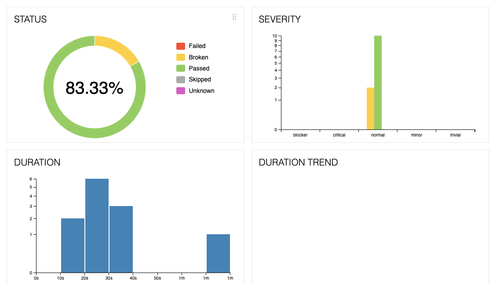
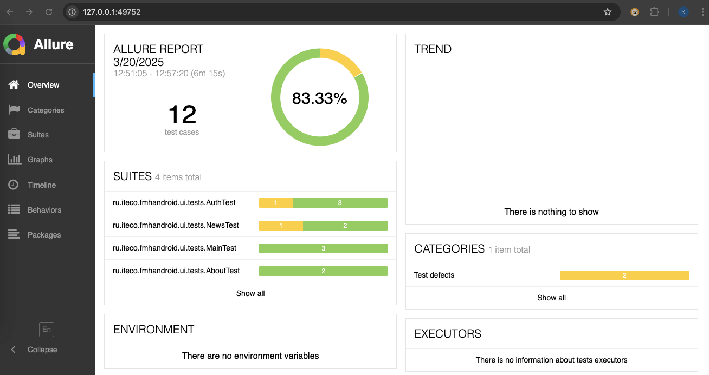
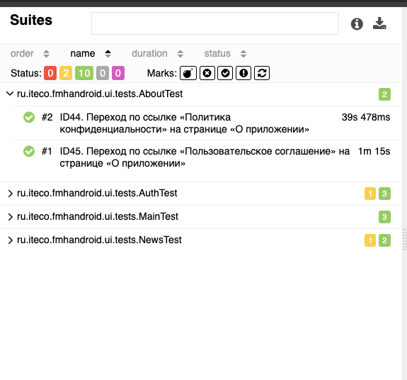
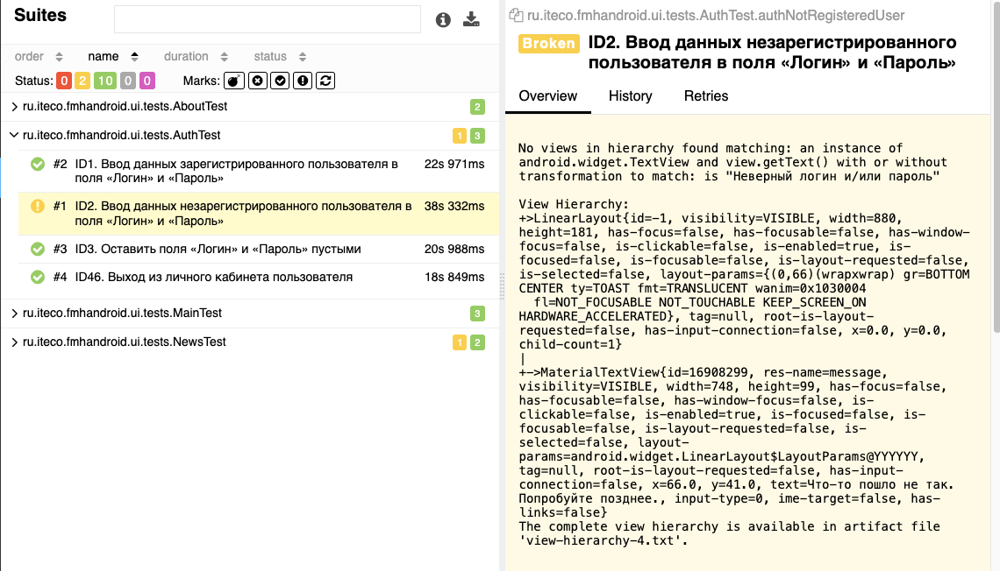
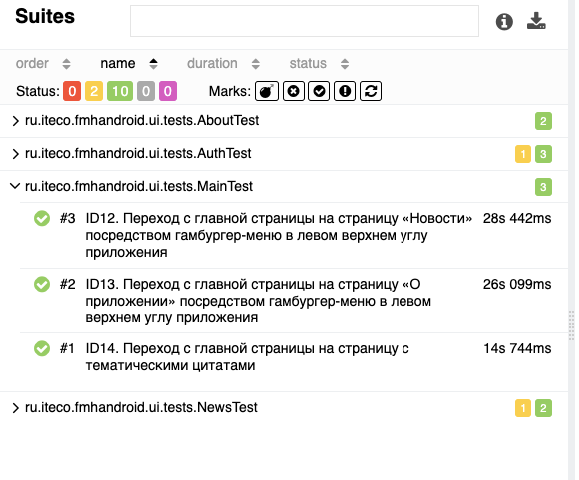
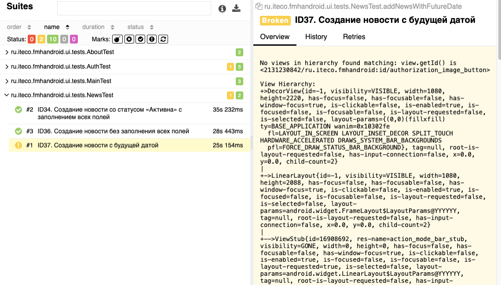

# **Отчёт о проведённом тестировании**

В соответствии с поставленной задачей было произведено тестирование мобильного приложения "Вхосписе".

### Реализовано
Все запланированное согласно Плану было реализовано. Выполнено 48 тест-кейса:
passed - 30;
failed - 18.

### Автоматизированное тестирование
В ходе автоматизирированного тестирования выполнено 12 тест-кейса:
passed - 10 (83,33%);
failed - 2 (16,67%).

В результате тестирования составлено 16 баг-репортов [Issues](https://github.com/TinitaQA/tinitaQADiplom/issues).

### Сработавшие риски
* cложность в поиске необходимых для тестирования элементов;
* нестабильная работы приложения;
* нестабильная работа эмулятора, необходимость частой перезагрузки приложения и Android Studio.

### Общий итог по времени
Время, затраченное на проект, соответствует запланированному.

### Общие рекомендации:
* устранить выявленные дефекты;
* необходима качественная документация, описывающая требуемое поведение приложения;
* хотелось бы видеть единообразие оформления приложения для визуального восприятия и удобства использования
(шрифт, наименования разделов приложения, элементы)

Ручное тестирование требует меньше временных затрат на старте, но становится сложным при дальнейшем
использовании (необходимость многократного выполнения одних и тех же действий). Автоматизированное 
тестирование, наоборот, требует больше временных затрат на начальном этапе, но позволяет экономить 
время и ресурсы в долгосрочной перспективе. 
